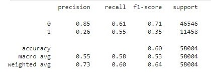

## Motivation

The motivation for this repository are the difficulties that the dataset present when we define the Target and Features. One of the problems involve **several data leakages**. 

Also there are several attempts in kaggle with low metrics particularly when we restrict the training set to features with information before the loan was granted and we want try to improve it:

https://www.kaggle.com/datasets/devanshi23/loan-data-2007-2014/data 

We use various data preprocces techniques like **SelectKbest with information value** , **Up-sampling with Imlearn**, **One Hot Encoder** and **Imputers**

## Problems at defining the target

**loan_status** (our target) has the followings values: 
<ol>
<li>Current                                                </li>
<li>Fully Paid                                             </li>
<li>Charged Off                                             </li>
<li>Late (31-120 days)                                       </li>
<li>In Grace Period                                          </li>
<li>Does not meet the credit policy. Status:Fully Paid       </li>
<li>Late (16-30 days)                                        </li>
<li>Default                                                   </li>
<li>Does not meet the credit policy. Status:Charged Off       </li>
</ol>

**The main point we must consider is that the values belong to differents moments in the loan life span.** 

Those that belong to an end of the Loan:
<ol>
<li>Fully Paid                                             </li>
<li>Charged Off                                             </li>
<li>Does not meet the credit policy. Status:Fully Paid       </li>
<li>Default                                                   </li>
<li>Does not meet the credit policy. Status:Charged Off       </li>
</ol>

Middle term of a loan:

<ol>
<li>Current                                                </li>
<li>Late (31-120 days)                                       </li>
<li>Late (16-30 days)                                        </li>
</ol>

while In Grace Period belongs to the beginning. 

On top of this we should consider:

<ol>
<li>**All the loans regardless its end, were previously in time "In Period Grace"**</li>
<li>**All the loans regardless its end, were previously in time Current and/or Late**</li>
</ol>

## Our target: 

"Good loans": 
<ol>
<li>Fully Paid                                             </li>
</ol>

"Bad loans": 

<ol>
<li>Charged Off                                             </li>
<li>Does not meet the credit policy. Status:Fully Paid       </li>
<li>Default                                                   </li>
<li>Does not meet the credit policy. Status:Charged Off       </li>
</ol>

We just consider ends of loans categorys in the target, and we should consider only features in X_train set that belong **before**
the loan was granted.

## Result metrics.

